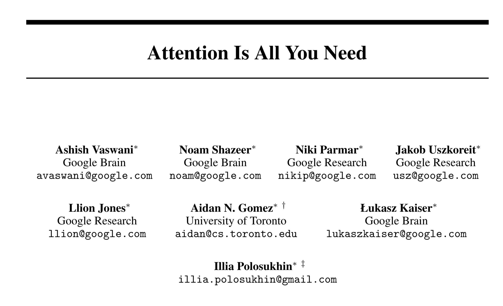
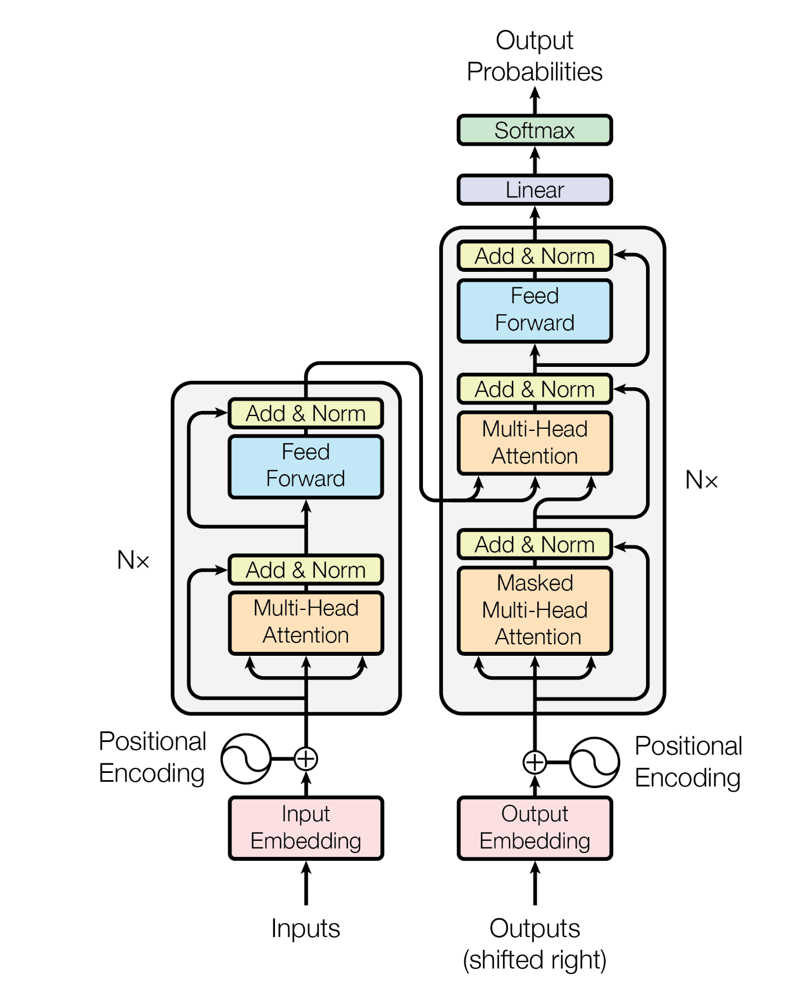
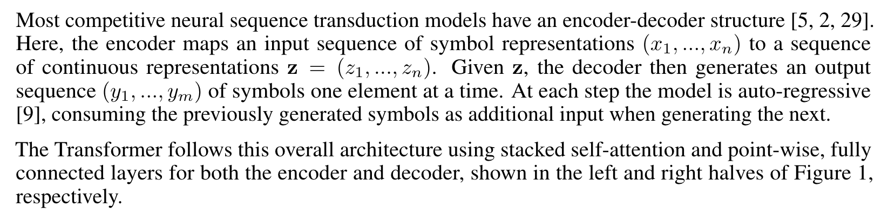
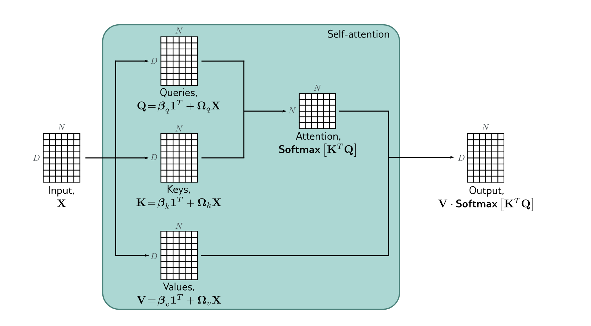
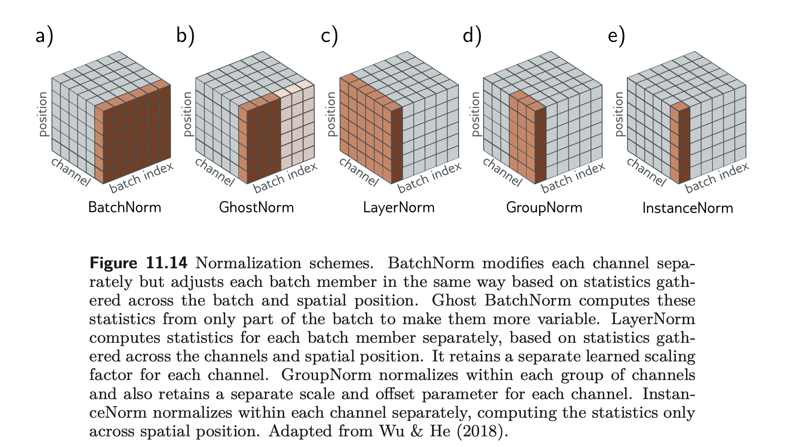
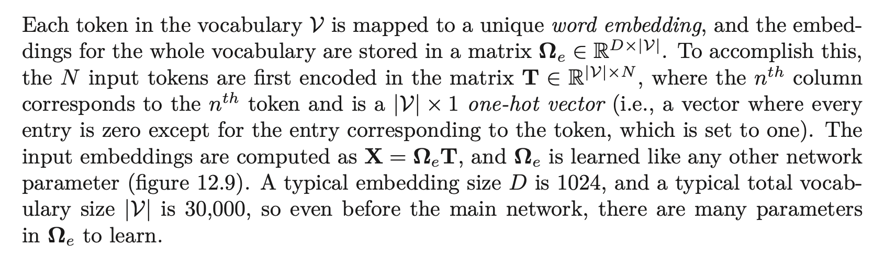
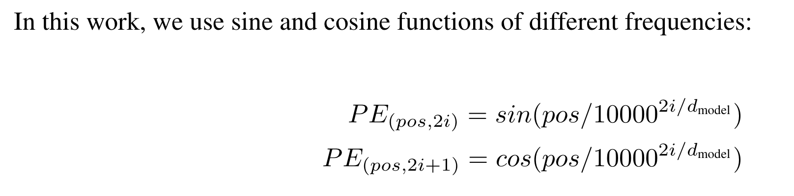

# Transformers architecture and attention mechanism

Main references: 

1. [Understanding deep learning](https://udlbook.github.io/udlbook/) by Simon J.D. Prince 

2. Attention is all you need [@vaswaniAttentionAllYou]

3. A hands-on website for DL called [Hugging Face](https://huggingface.co)

---

# Applications

1. **Natural Language Processing (NLP)**: (Google Translate, Microsoft Translator), text summarization, sentiment analysis.

2. **Speech Recognition and Generation**: Transformers have been applied to convert spoken language into written form, and vice versa, providing assistive technology and improving human-computer interaction.

3. **Autoregressive Image Modeling**: Generative Pre-training Transformer 3 (**GPT-3**) has demonstrated its prowess not only in text but also in image generation tasks, heralding a new era of creative AI applications.

4. **Protein Structure Prediction**: AlphaFold 2, an AI developed by DeepMind, utilizes transformer models to predict 3D structures of proteins, significantly advancing the field of molecular biology.

5. **Time-series Analysis**: With their ability to handle sequential data, transformers have been used for financial forecasting, climate prediction, and other types of time-series analysis.

---

# Origin

- Transformer models originated from a groundbreaking paper titled "Attention is All You Need" by Vaswani et al[@vaswaniAttentionAllYou]., published in 2017. This paper introduced the "Transformer" architecture, replacing the prevalent use of Recurrent Neural Networks (RNNs) and Convolutional Neural Networks (CNNs) in sequence processing tasks.

- The **"attention mechanism"** lies at the heart of transformers. Traditional Deep Neural Networks (DNNs), such as CNNs and RNNs, process data sequentially, which can lead to issues with long dependencies and computational efficiency. However, transformers handle inputs all at once, paying "attention" to different parts of the input when producing the output.

---

## RNN vs. Transformers

---

# Attention is all you need 

---

> Abstract
>
> The dominant sequence transduction models are based on complex recurrent or convolutional neural networks that include an encoder and a decoder. The best performing models also connect the encoder and decoder through an attention mechanism. **We propose a new simple network architecture, the Transformer, based solely on attention mechanisms, dispensing with recurrence and convolutions entirely.** Experiments on two machine translation tasks show these models to be superior in quality while being more parallelizable and requiring significantly less time to train. Our model achieves 28.4 BLEU on the WMT 2014 Englishto-German translation task, improving over the existing best results, including ensembles, by over 2 BLEU. On the WMT 2014 English-to-French translation task, our model establishes a new single-model state-of-the-art BLEU score of 41.0 after training for 3.5 days on eight GPUs, a small fraction of the training costs of the best models from the literature.
>
> @vaswaniAttentionAllYou

--- 

# The Transformer - model architecture

---

# Architecture Details 

## Architecture

## Definition of attention

**An attention function can be described as mapping a query and a set of key-value pairs to an output, where the query, keys, values, and output are all vectors.**

---

## 'Self-attention' (sees all at once)

$$
\text{SA}(X) = V \cdot \text{Softmax} \left[ \frac{K^{T}Q}{\sqrt{D_q}}   \right], \quad (12.9)
$$

---

## **Q**uery, **K**ey and **V**alue

1. **Queries**: You can think of queries as "questions" that the model asks when trying to decide where to focus attention.
2. **Keys**: Keys can be seen as "labels" associated with the information in the input sequence. The model compares each query to all keys to determine where the relevant information lies.
3. **Values**: Once the model identifies which keys (or "labels") are relevant to the query (or "question"), it uses the associated values to produce the final output.

- A real-world analogy: Suppose you're in a library, looking for a specific book (your "query"). The "keys" are like the tags on each book, and you check these tags to find the book you need. Once you've found the right tags ("keys") that match your query, you pick the corresponding books ("values") from the shelf.

--- 

## Multi-Head Attention

---

$$
\text{MultiHead}(Q, K, V ) = 
\text{Concat}(\text{head}_1, \dots, \text{head}_h)W^O,$$
where
$$
 \text{head}_i = \text{Attention}
 (QW_i^Q, KW_i^K , VW_i^V).
$$

where the projections are parameters matrices 
$W_i^Q \in \mathbb{R}^{d_\text{model} \times d_k}$,
$W_i^K \in \mathbb{R}^{d_\text{model} \times d_k}$,
$W_i^V \in \mathbb{R}^{d_\text{model} \times d_v}$,
$W_i^O \in \mathbb{R}^{hd_v \times d_\text{model}}$.

---

## Batch-Norm and Layer-Norm

---

- The cat sat on the mat.

- In machine learning, a convolutional neural network is a class of deep neural networks, most commonly applied to analyzing visual imagery.

- In the middle of a quiet, quaint town, nestled in the heart of the country, where the air is as sweet as honey and the people are as warm as the sun-soaked fields, there sat an ancient library, a vestige of a bygone era, teeming with books, manuscripts, and maps, its cobweb-laden corners whispering stories of adventurers who braved the tempestuous seas, of star-crossed lovers torn apart by fate, of wise sages who deciphered the universe's deepest mysteries, and of fearless warriors who fought in epic battles that shook the heavens and the earth, with each tale more captivating than the last, drawing in curious minds like moths to a flame, young and old, rich and poor, scholar and farmer, for in this library, knowledge knew no bounds, stories knew no end, and time seemed to lose its inexorable march, making it a haven for those seeking to escape the mundane, to dive into the extraordinary, and to explore the boundless realms of the imagination, and for centuries, it stood as a beacon of enlightenment, a testament to the indomitable spirit of the human intellect, the insatiable curiosity of the human heart, and the transcendent power of stories to connect us, inspire us, and define us, spanning generations and withstanding the test of time, a constant in an ever-changing world.

---

## Embeddings

---

### A made-up exmaple

Consider the following 3 sentences:

1. The cat sat on the mat.
2. The dog sat on the log.
3. Cats and dogs are both pets.

> - In NLP, **embeddings** are vector representations of words in a high-dimensional space, where the position and distance between vectors capture semantic meaning. 
For simplicity's sake, let's imagine this high-dimensional space as a **2D plane**.

---

### tokens

- 'The' = [0.1, 0.3]
- **'cat' = [0.2, 0.8]**
- 'sat' = [0.3, 0.1]
- 'on' = [0.2, 0.2]
- 'the' = [0.1, 0.3]
- 'mat' = [0.6, 0.6]
- 'dog' = [0.5, 0.9]
- 'log' = [0.7, 0.7]
- **'cats' = [0.21, 0.81]**
- 'and' = [0.15, 0.45]
- 'dogs' = [0.51, 0.91]
- 'are' = [0.4, 0.3]
- 'both' = [0.3, 0.4]
- 'pets' = [0.5, 0.4]

> - In a well-trained embedding space, semantically similar words are located close to each other. 
For example, 'cat' and 'cats' have similar embeddings, as do 'dog' and 'dogs'.

---

### "Cats and dogs are both pets."

- [[0.21, 0.81],
- [0.15, 0.45],
- [0.51, 0.91],
- [0.4, 0.3],
- [0.3, 0.4],
- [0.5, 0.4]]

> Tensor representation of "Cats and dogs are both pets."

> - In real-world applications, each of these vectors would typically have many more dimensions (often 100, 300, or even more), 
and there would often be additional steps such as padding (to handle sentences of different lengths), dealing with unknown words, and other complexities. 

---

## Positional Encoding

> where $pos$ is the position and $i$ is the dimension.
> 
> Attention is all you need (Vaswani et al. 2017)

> - Without positional encoding, 
a transformer model can lose information about the sequence of words.

---

# A trick to use ChatGPT 

> - Instead of asking GPT-3 "Translate the following English text to French:", you might get better results with a prompt like "**As an expert French translator**, translate the following English text to French:".

> - Proofread "...";

> - Suppose you're a professor in Statistics, Proofread "...".

---
