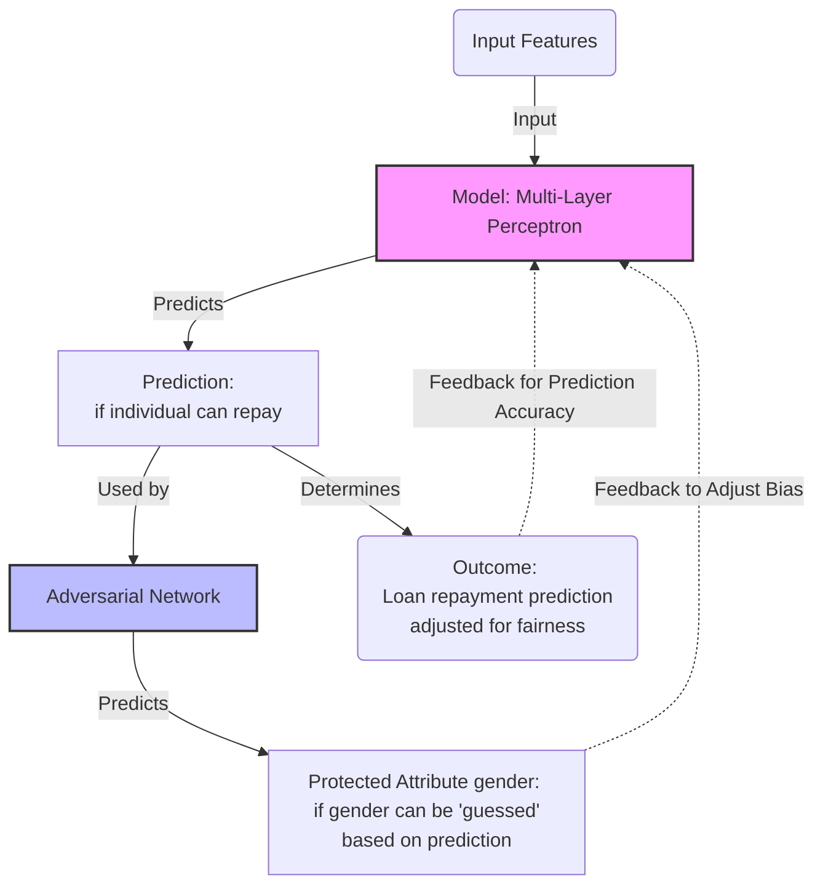

---

```yaml
layout: table-of-contents
```

## TOC

---

```yaml
class: text-2xl
```

## Intro: fairness

In the field of deep learning, especially within the context of fairness, mathematical criteria are developed to ensure that algorithms make decisions that are equitable and do not perpetuate biases present in the data.

One such criterion is the concept of **separation**, particularly relevant in binary classification tasks. This concept revolves around ensuring that the predictive model's decisions are fair with respect to **a protected variable**, such as race, gender, or age.

---

```yaml
class: text-base
```

## Definition of **Separation**

**Separation**, in the context of fairness in machine learning, demands that the prediction ($\hat{y}$) should be conditionally independent of the protected attribute/variable ($a$) given the true outcome ($y$). 

Formally, this can be represented as:

$$
P(\hat{y} | a, y) = P(\hat{y} | y)
$$

<br>
<br>

This criterion implies that, for individuals with the same outcome ($y$), their predicted outcome ($\hat{y}$) should not depend on their protected attribute ($a$).
Essentially, it means that the model's predictions should be equally accurate for all groups defined by the protected attribute when they have the same true label.

---

## Example: Loan Approval Prediction

Suppose we want to train a DL model to predict whether individuals should be approved for a load.
The **protected** variable ($a$) here is **gender** and outcome ($y$) is whether the individual would repay the loan if given (yes = 1, no =0).

The goal is to ensure the model's predictions $\hat{y}$ **do not** depend on gender when they have the **same true label** for loan repayment.

**Model design**:

* Use a neural network with several layers. The input layer accepts **all features except gender**, which is not directly used in making the prediction to avoid direct bias.

* Incorporate **an adversarial network** that tries to predict the protected attribute (gender) from the model's predictions.

* The main model is trained to make accurate predictions while also minimizing the success of the adversarial network, thus encouraging fairness according to the separation principle.

---

```yaml
layout: image
```

## Diagram illustration



---

```yaml
class: text-2xl
```

## Importance of **Separation**

The separation measure is crucial for addressing and mitigating discrimination in automated decision-making processes. It targets the fairness of error rates across groups, such as equal false positive rates and false negative rates, ensuring that the algorithm's performance is consistent across different demographics.

This does not imply removing $a$ from the model's consideration in a way that it has no influence on the joint distribution of predictors and outcomes. Instead, it means ensuring that, once the true outcome $y$ is known, the prediction $\hat{y}$ should be the same regardless of $a$.

---

```yaml
class: text-2xl
```

## Accuracy vs. Fairness Trade-off

Implementing fairness constraints, like separation, often comes at the cost of overall model accuracy.

Fairness interventions can restrict the model's ability to fully leverage all available information in the training data, some of which may correlate with the protected attribute but also with the target variable.

The challenge lies in finding a balance that minimizes unfair bias without unduly compromising the model's predictive performance.
